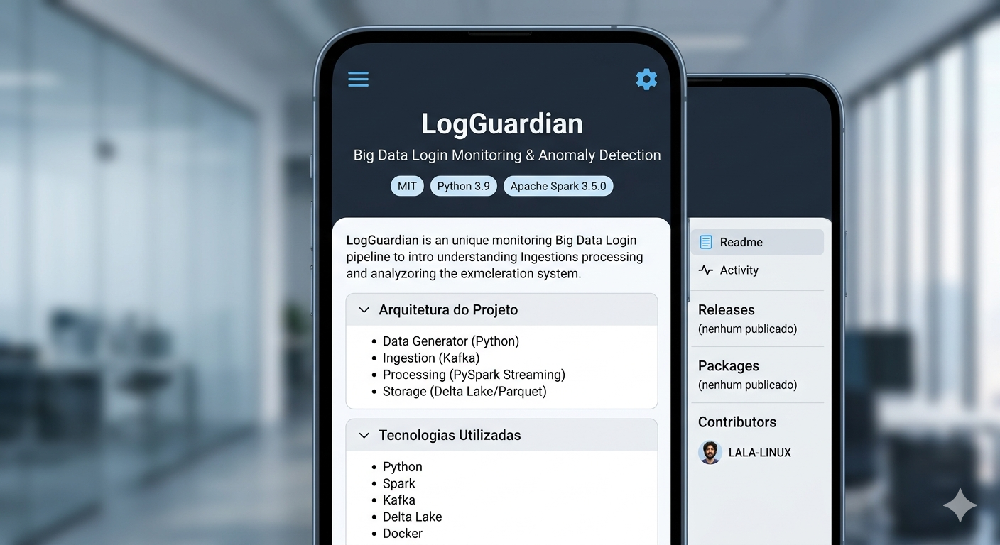
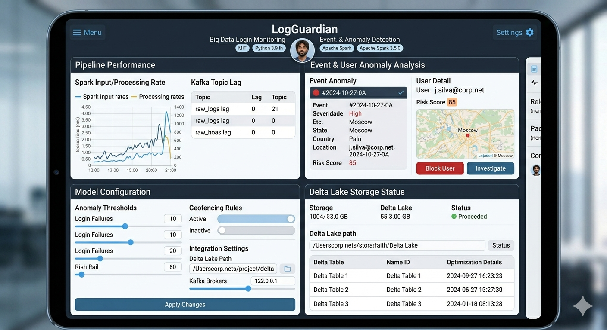
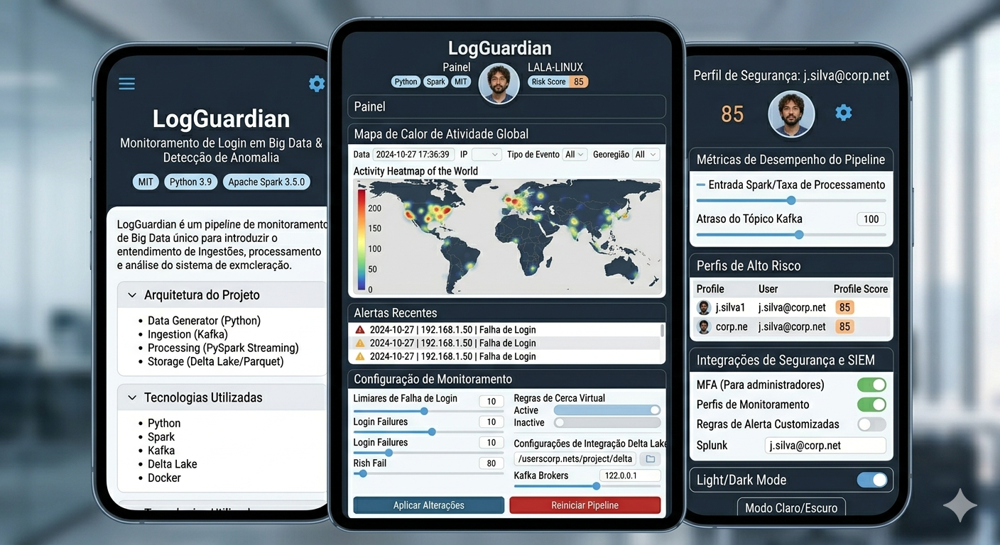
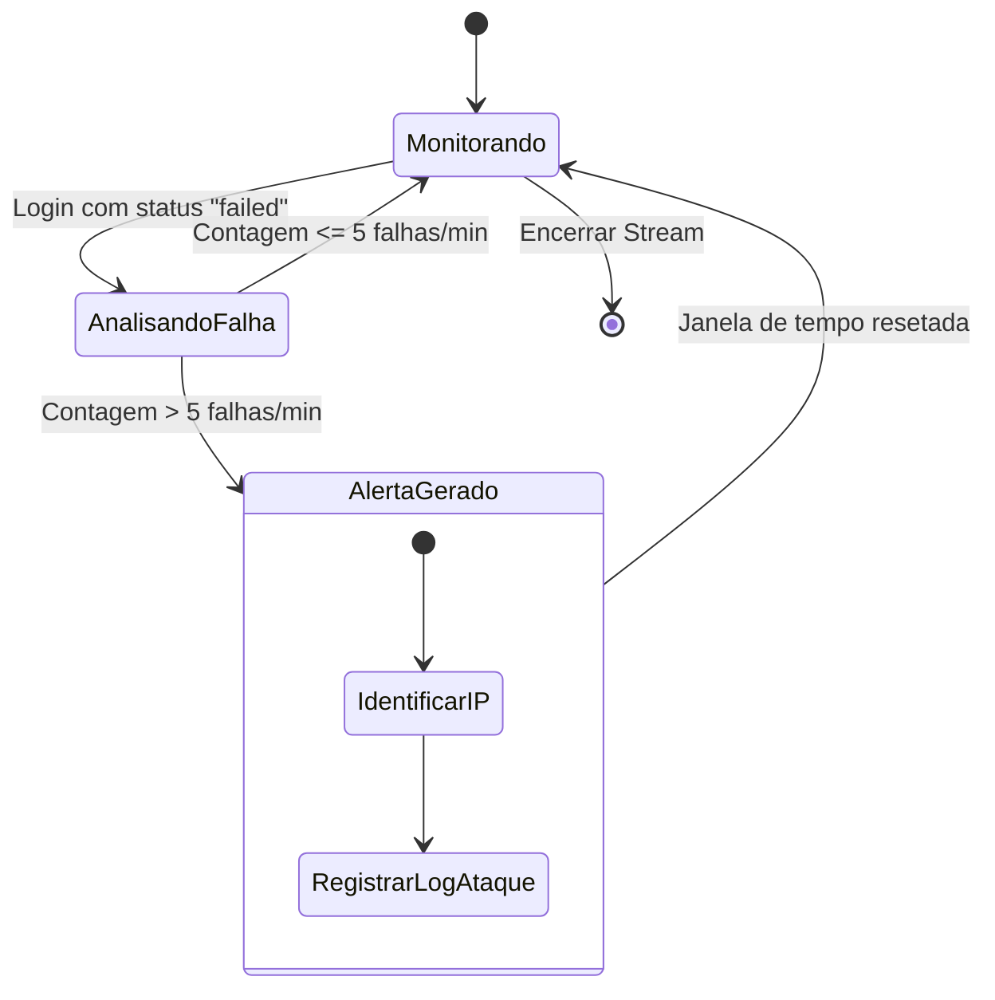
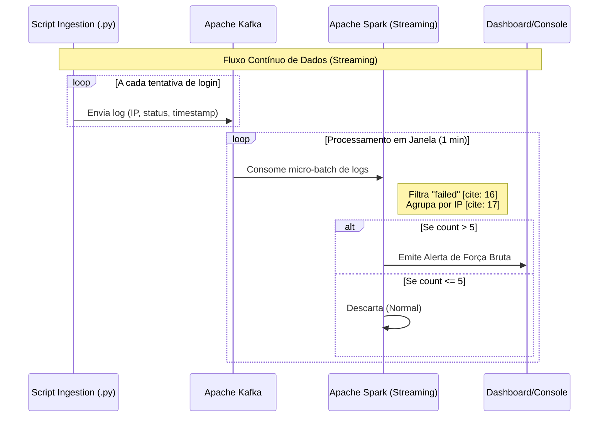
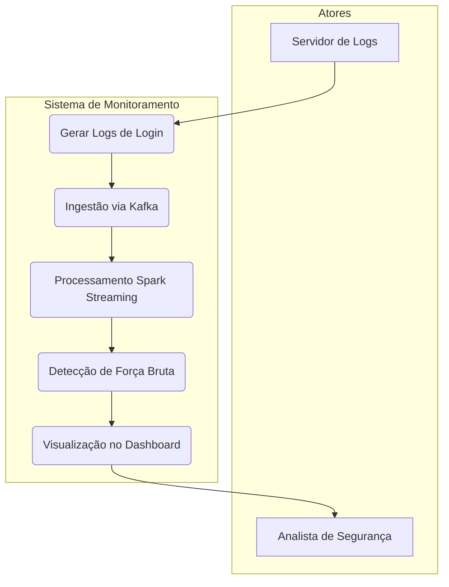

# 🛡️ LogGuardian: Big Data Login Monitoring & Anomaly Detection

[](https://opensource.org/licenses/MIT)
[](https://www.python.org/downloads/)
[](https://spark.apache.org/)





O **LogGuardian** é um pipeline de Big Data projetado para processar fluxos massivos de logs de autenticação em tempo real. O sistema identifica tentativas de ataques de força bruta (Brute Force) e anomalias de acesso utilizando processamento de stream.

---

## 🚀 Arquitetura do Projeto

O projeto simula um ambiente de produção escalável:

1.  **Data Generator (Python):** Script que gera eventos sintéticos de login (sucesso/falha) em formato JSON.
2.  **Ingestion (Apache Kafka):** Atua como o buffer de mensagens, garantindo que nenhum log seja perdido.
3.  **Processing (PySpark Streaming):** Consome os dados do Kafka, aplica janelas de tempo (*windowing*) e filtra IPs com comportamento suspeito.
4.  **Storage (Delta Lake/Parquet):** Armazena os logs processados de forma otimizada para consultas analíticas.

---

## 🛠️ Tecnologias Utilizadas

* **Linguagem:** Python 3.9
* **Processamento:** Apache Spark (PySpark Structured Streaming)
* **Mensageria:** Apache Kafka
* **Armazenamento:** Delta Lake (ou Parquet)
* **Infraestrutura:** Docker & Docker Compose

---

## 📊 Regra de Detecção (Brute Force)

O pipeline está configurado para gerar um alerta sempre que um endereço IP apresentar:
* **Mais de 5 falhas de login**
* **Dentro de uma janela de 1 minuto**
* **Utilizando o conceito de Watermarking** para lidar com dados que chegam atrasados.
  
---

## 📁 Estrutura de Pastas

```text
├── data/               # Amostras de logs gerados
├── docker/             # Dockerfile e docker-compose.yml
├── notebooks/          # Exploração de dados (EDA)
├── src/                # Código fonte do pipeline
│   ├── generator.py    # Produtor de logs (Kafka Producer)
│   └── processor.py    # Processador Spark (Kafka Consumer)
└── requirements.txt    # Dependências do projeto
```








1
